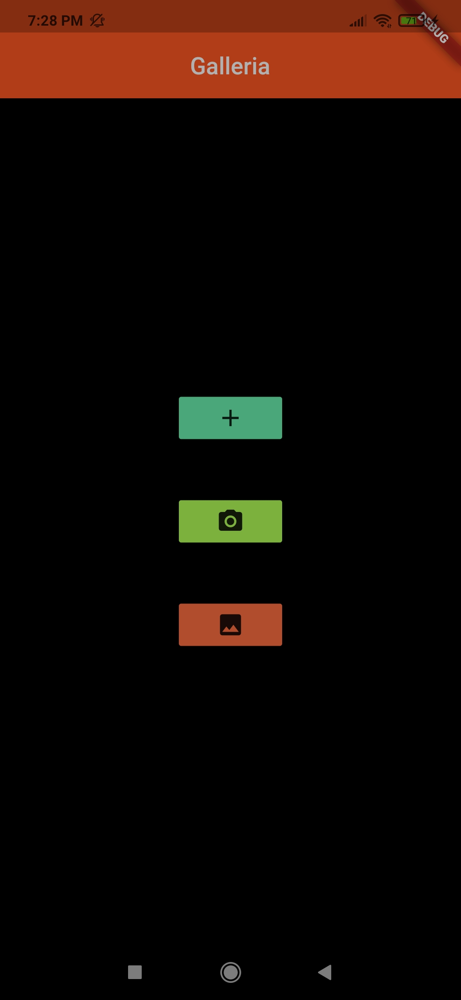
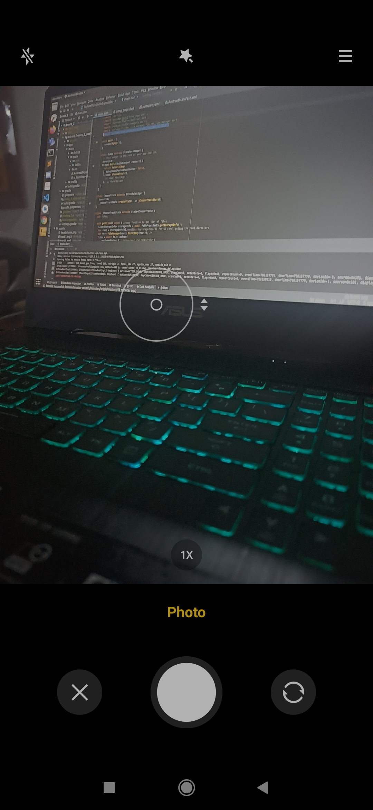
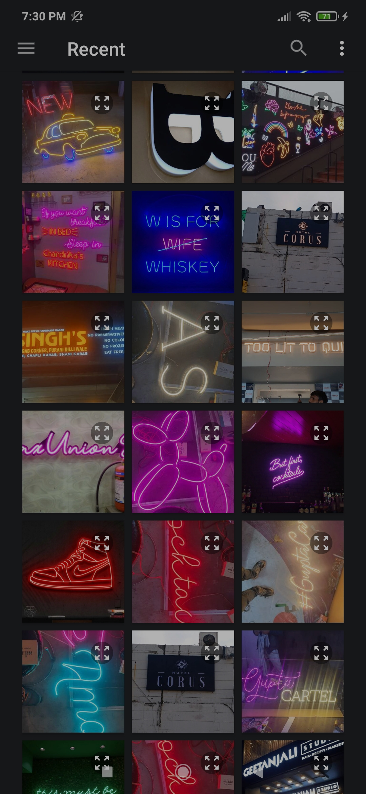
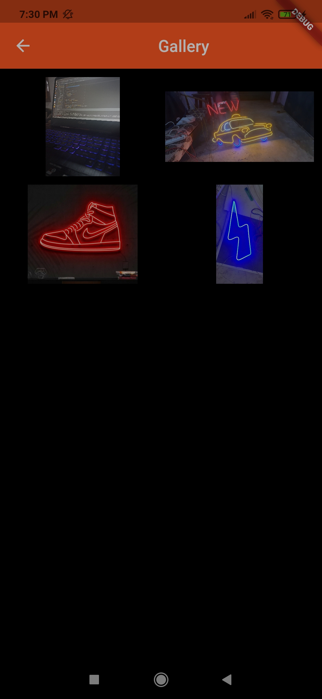

# Galleria
Photo Management app  

An app that integrates with your device gallery and camera. You can import selected images to Galleria or add more pictures through the lens to your personalized gallery.

## Packages used:
image_picker: ^0.7.4  
path: ^1.8.0  
path_provider: ^2.0.1  
provider: ^5.0.0  
camera: ^0.8.1  
image_gallery: ^1.2.0  

## Screenshots

## Getting Started

This project is a starting point for a Flutter application.

A few resources to get you started if this is your first Flutter project:

- [Lab: Write your first Flutter app](https://flutter.dev/docs/get-started/codelab)
- [Cookbook: Useful Flutter samples](https://flutter.dev/docs/cookbook)

For help getting started with Flutter, view our
[online documentation](https://flutter.dev/docs), which offers tutorials,
samples, guidance on mobile development, and a full API reference.
